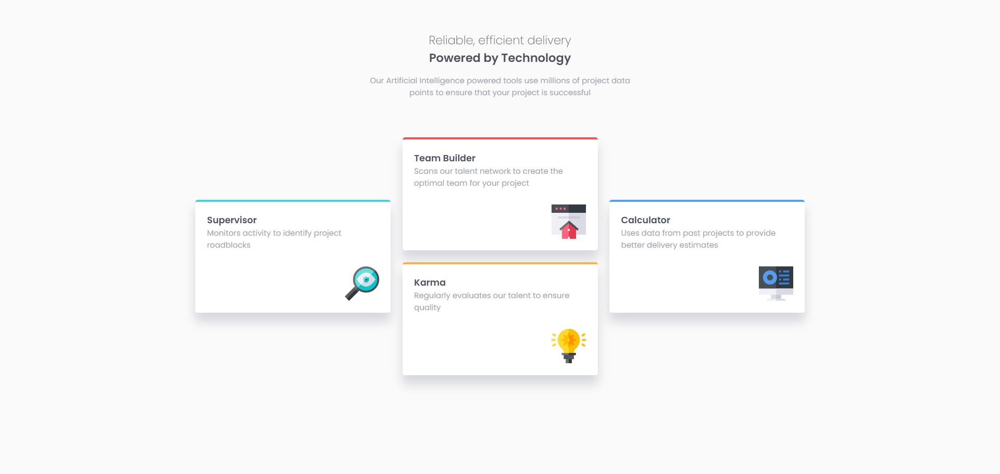

# Frontend Mentor - Four card feature section solution

This is a solution to the [Four card feature section challenge on Frontend Mentor](https://www.frontendmentor.io/challenges/four-card-feature-section-weK1eFYK). Frontend Mentor challenges help you improve your coding skills by building realistic projects. 

## Table of contents

- [Overview](#overview)
  - [The challenge](#the-challenge)
  - [Screenshot](#screenshot)
  - [Links](#links)
- [My process](#my-process)
  - [Built with](#built-with)
- [Author](#author)

## Overview

### The challenge

Users should be able to:

- View the optimal layout for the site depending on their device's screen size

### Screenshot

### Links

- Solution URL: [https://github.com/barka-dev/four-card-feature-section-master.git](https://your-solution-url.com)
- Live Site URL: [https://barka-dev.github.io/four-card-feature-section-master/](https://your-live-site-url.com)

## My process

### Built with

- Semantic HTML5 markup
- CSS custom properties
- Flexbox
- CSS Grid
- Mobile-first workflow

## Author

- Website - [Abdessalam Barka](https://www.your-site.com)
- Frontend Mentor - [@barka-dev](https://www.frontendmentor.io/profile/barka-dev)
- Twitter - [@AbdessalamBarka](https://www.twitter.com/yourusername)
